#设计模式
##策略模式
定义了算法族，分别封装起来，让他们之前可以相互替换，此模式的算法可以独立于使用它的客户。
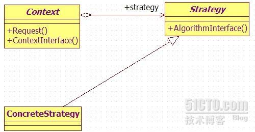
###游戏中的应用🌰
[角色类使用发射行为](http://blog.csdn.net/qianqing13579/article/details/45540165)
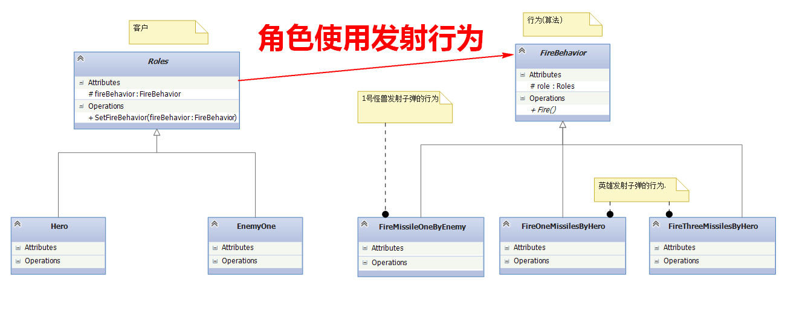

```
public abstract class Roles : RoAndMi {
    //拥有发射子弹的行为
    protected FireBehavior fireBehavior;
    //更换发射子弹的行为
    public void SetFireBehavior(FireBehavior fireBehavior)
    {
        this.fireBehavior = fireBehavior;
    }
    /// <summary>
    /// 调用fireBehavior.Fire()实现真正的发射
    /// </summary>
    public  void Fire()
    {
        fireBehavior.Fire();
    }
    ...
}
```

```
public class Hero : Roles {
   public Hero(int x, int y, int xspeed, int yspeed, int life, bool good)
        : base(x, y, myImage.Width, myImage.Height, xspeed, yspeed, life, good)
    {
        blb = new BloodBar(x,y, life);
        //Hero拥有FireOneMissilesByHero行为
        SetFireBehavior(new FireOneMissilesByHero(this));

    }
}
```

```
public abstract class FireBehavior {
    protected Roles role;//哪个角色的射击
    public abstract void Fire();
}
```

```
//Hero拥有的行为
 class FireOneMissilesByHero : FireBehavior {
    public FireOneMissilesByHero(Roles r)
    {
        this.role = r;
    }
    //工厂方法，生产子弹
    public override void Fire()
    {
        if (!role.Live)
        {
            return;
        }
        HitCheck.GetInstance().AddElement(new MissileHero(HitCheck.GetInstance().MyHero, 20, 20, HitCheck.GetInstance().MyHero.Good, MissileDirection.U, 10));
    }
}
```

```
//更换行为,升级装备
 if (myHero.score > 100)
            myHero.SetFireBehavior(new FireThreeMissilesByHero(myHero));//策略模式
```

###游戏中为什么要使用策略模式？
游戏中，英雄和敌人有个发射子弹的行为FireBehavior(继承自Roles)，但是每个角色的行为都不一样，而且同一个角色在游戏中的发射子弹的行为也会发生变化，如英雄一开始每次只能发射一颗子弹，后来由于经验值增加，每次可以发射多个子弹，发射行为在游戏中会发生变化，在程序中需要更换行为，如果以后游戏要升级，角色会拥有更多的行为，如果使用策略模式，将不同的发射子弹的行为看成是FireBehavior的不同变体，让他们可以相互替换，那么以后升级游戏将会变得很容易。 

##工厂模式
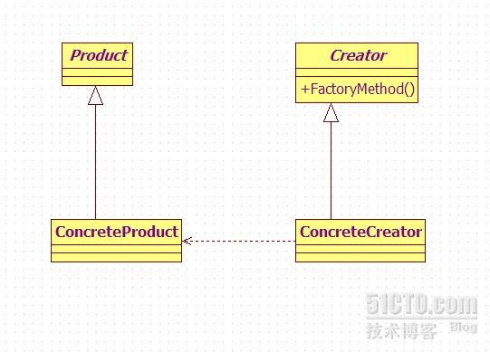
[链接](http://blog.csdn.net/qianqing13579/article/details/45541727)
###游戏中的应用🌰
##命令模式
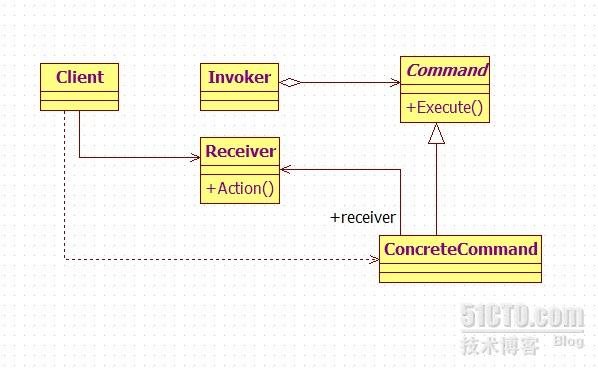

###游戏中的应用🌰
* 配置输入
在每个游戏中都有一块代码读取用户的输入——按钮按下，键盘敲击，鼠标点击，诸如此类。 这块代码会获取用户的输入，然后将其变为游戏中有意义的行为。
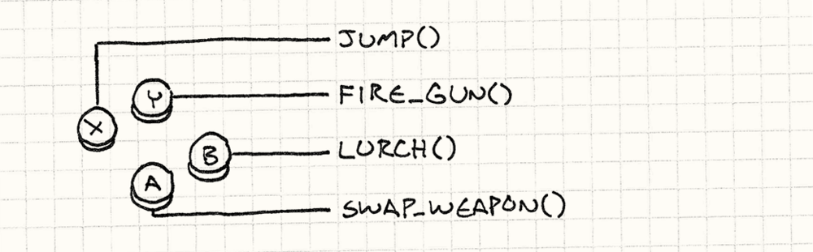

```
void InputHandler::handleInput(){

 if (isPressed(BUTTON_X)) jump();

 else if (isPressed(BUTTON_Y)) fireGun();

 else if (isPressed(BUTTON_A)) swapWeapon();

 else if (isPressed(BUTTON_B)) lurchIneffectively();

}
```

```
class JumpCommand: ICommand {

   public void execute() {

       //这此方法可能来自另外的类，这里只是表达一下调用的意思。

       jump();

   }

}

 
class FireCommand : ICommand {

	public void execute() {
	
	   fireGun();
	
	}

}

///下面省略几千行
```

```
class InputHandler {
   private ICommand commandX;
   private ICommand commandY;
   private ICommand commandA;
   private ICommand commandB;
   //处理输入的操作
   public void handleInput() {
       if (isPressed(BUTTON_X)) commandX.execute();
       else if (isPressed(BUTTON_Y)) commandY.execute();
       else if (isPressed(BUTTON_A)) commandA.execute();
       else if (isPressed(BUTTON_B)) commandB.execute();
   }
	//这是另外一个使用方式，与上面的是一样的，这里把command传出去
   ICommand InputHandler::handleInput() {
       if (isPressed(BUTTON_X)) return commandX;
       if (isPressed(BUTTON_Y)) return commandY;
       if (isPressed(BUTTON_A)) return commandA;
       if (isPressed(BUTTON_B)) return commandB;
       // Nothing pressed, so do nothing.
       return NULL;
   }
}
```
* 关于角色说明
传入一个我们想要的控制对象而不是让命令自身来确定所要控制的对象

```
class Command {
  public：
  virtual ~Command() {}
  virtual void execute(GameActor& actor) = 0;
}

class JumpCommand : public Command {
  public:
  virtual void execute(GameActor& actor){
    actor.jump();
  }
}

Command* InputHandler::handlerInput() {
  if (isPressed(BUTTON_X)) return buttonX_;
  if (isPressed(BUTTON_Y)) return buttonY_;
  if (isPressed(BUTTON_A)) return buttonA_;
  if (isPressed(BUTTON_B)) return buttonB_;
  return NULL;
}

Command* command = inputHandler.handlerInput();
if(command) {
  command -> execute(actor);
}
```

应用：
1、在命令和角色之间加入间接层使得我们让玩家控制游戏中的任何角色，只需通过改变命令执行时传入的角色对象即可。
2、AI代码简单地提供命令对象以供执行。选择命令的AI和表现玩家的代码之间的解耦为我们提供了很大的灵活性。我们可以对不同的角色使用不同的AI模块。或者我们可以针对不同种类的行为将AI进行混搭。你想要一个更加具有侵略性的敌人？只需要插入一段更具侵略性的AI代码来为它生成命令。事实上，我们甚至可以将AI使用到玩家的角色身上，这对于实现自动演算的游戏演示模式是很有用的。
3、如果我们把这些命令序列化，我们便可以通过网络发送数据流。我们可以通过网络发送到另一台机器上，然后进行回访。这是多人网络游戏中的一部分。

* 撤销和重做


```
class MoveUnitCommand : ICommand
   {
       private int beforeX;
       private int beforeY;
       private int _x;
       private int _y;
       private Unit unit;
       
       public MoveUnitCommand(Unit unit,int x,int y)
       {
           this.unit = unit;
           this.beforeX = 0;
           this.beforeY = 0;
           this._x = x;
           this._y = y;
       }
       public void execute()
       {
           unit.moveTo(_x, _y);
       }
}

ICommand handleInput() {
   Unit unit = getSelectedUnit();
   int destY = 0;
   if (isPressed(BUTTON_UP))
   {
       // Move the unit up one.
       destY = unit.getY() - 1;
       return new MoveUnitCommand(unit, unit.getX(), destY);
   }
   if (isPressed(BUTTON_DOWN))
   {
       // Move the unit down one.
       destY = unit.getY() + 1;
       return new MoveUnitCommand(unit, unit.getX(), destY);
   }
   // Other moves...
   return NULL;
}
```

```
interface ICommand {
   void execute();
   void undo();
}

class MoveUnitCommand : ICommand {
   private int beforeX;
   private int _x;
   private int _y;
   private int beforeY;
   private Unit unit;
   
   public MoveUnitCommand(Unit unit,int x,int y) {
       this.unit = unit;
       this.beforeX = 0;
       this.beforeY = 0;
       this._x = x;
       this._y = y;
   }
   public void execute() {
       this.beforeX = unit.getX();
       this.beforeY = unit.getY();
       unit.moveTo(_x, _y);
   }
   public void undo() {
       unit.moveTo(beforeX, beforeY);
   }
}
```

应用：回放, 实际上，许多游戏会记录每一帧每个实体所执行的一系列命令。为了回放游戏，引擎只需要模拟正常游戏的运行，执行预先录制的命令即可。

##空对象模式
注意，我们这里没有检查命令是否为NULL，因为这里假设了每个按钮都有某个命令对象与之对应关联。
如果你想要支持不处理任何事情的按钮，而不用明确检查按钮对象是否为NULL，我们可以定义一个命令类，这个命令类中的execute()方法不执行任何事情。然后我们将按钮处理器（button handler）指向一个空值对象，null object，就好像他指向了NULL一样

##状态模式
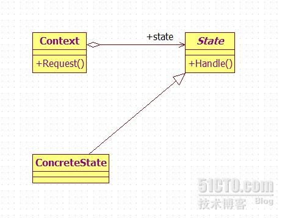
###游戏中的应用🌰
[有限状态机](http://blog.csdn.net/potato47/article/details/53465575)
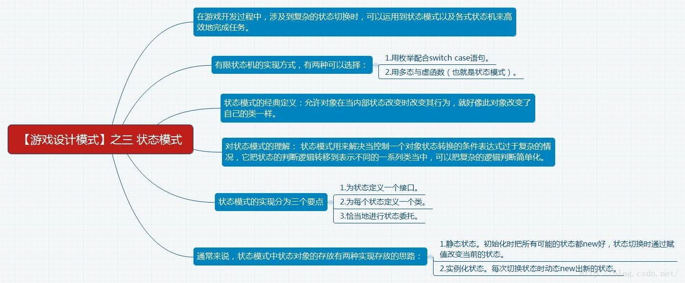

假如我们现在正在开发一款横版游戏。当前的任务是实现玩家用按键操纵女英雄。当按下向上方向键的时候，女英雄应该跳跃。那么我们可以这样

```
void Heroine::handleInput(Input input) {  
    if (input == PRESS_UP)  
    {  
        yVelocity_ = JUMP_VELOCITY;  
        setGraphics(IMAGE_JUMP);  
    }  
}

void Heroine::handleInput(Input input) {  
    if (input == PRESS_UP)  
    {  
        yVelocity_ = JUMP_VELOCITY;  
        setGraphics(IMAGE_JUMP);  
    }  
}  
```
OK，实现是实现了，但是一堆BUG。比如，我们没有防止主角“在空中跳跃“，当主角跳起来后持续按向上键，会导致她一直飘在空中。简单地修复方法可以是：添加一个 isJumping布尔值变量。当主角跳起来后，就把该变量设置为True.只有当该变量为False时，才让主角跳跃，代码如下：

```
void Heroine::handleInput(Input input){  
  if (input == PRESS_UP)  
  {  
    if (!isJumping_)  
    {  
      isJumping_ = true;  
      // Jump...  
    }  
  }  
}
void Heroine::handleInput(Input input){  
  if (input == PRESS_UP)  
  {  
    if (!isJumping_)  
    {  
      isJumping_ = true;  
      // Jump...  
    }  
  }  
} 
```
接下来，我们想实现主角的闪避动作。当主角站在地面上的时候，如果玩家按下向下方向键，则下蹲躲避，如果松开此键，则起立。代码如下：

```
void Heroine::handleInput(Input input){  
    if (input == PRESS_UP)  
    {  
        // Jump if not jumping...  
    }  
    else if (input == PRESS_DOWN)  
    {  
        if (!isJumping_)  
        {  
            setGraphics(IMAGE_DUCK);  
        }  
    }  
    else if (input == RELEASE_DOWN)  
    {  
        setGraphics(IMAGE_STAND);  
    }  
}

void Heroine::handleInput(Input input) {  
    if (input == PRESS_UP)  
    {  
        // Jump if not jumping...  
    }  
    else if (input == PRESS_DOWN)  
    {  
        if (!isJumping_)  
        {  
            setGraphics(IMAGE_DUCK);  
        }  
    }  
    else if (input == RELEASE_DOWN)  
    {  
        setGraphics(IMAGE_STAND);  
    }  
} 
```

找找看， 这次bug又在哪里？
使用这段代码，玩家可以：按向下键下蹲，按向上键则从下蹲状态跳起，英雄会在跳跃的半路上变成站立图片…….是时候增加另一个标识了……

```
void Heroine::handleInput(Input input) {  
    if (input == PRESS_UP)  
    {  
        if (!isJumping_ && !isDucking_)  
        {  
            // Jump...  
        }  
    }  
    else if (input == PRESS_DOWN)  
    {  
        if (!isJumping_)  
        {  
            isDucking_ = true;  
            setGraphics(IMAGE_DUCK);  
        }  
    }  
    else if (input == RELEASE_DOWN)  
    {  
        if (isDucking_)  
        {  
            isDucking_ = false;  
            setGraphics(IMAGE_STAND);  
        }  
    }  
}  

void Heroine::handleInput(Input input) {  
    if (input == PRESS_UP)  
    {  
        if (!isJumping_ && !isDucking_)  
        {  
            // Jump...  
        }  
    }  
    else if (input == PRESS_DOWN)  
    {  
        if (!isJumping_)  
        {  
            isDucking_ = true;  
            setGraphics(IMAGE_DUCK);  
        }  
    }  
    else if (input == RELEASE_DOWN)  
    {  
        if (isDucking_)  
        {  
            isDucking_ = false;  
            setGraphics(IMAGE_STAND);  
        }  
    }  
}  

```

下面再加一点功能，如果玩家在跳跃途中按了下方向键，英雄能够做下斩攻击就太炫酷了。其代码实现如下：

```
void Heroine::handleInput(Input input) {  
    if (input == PRESS_UP)  
    {  
        if (!isJumping_ && !isDucking_)  
        {  
            // Jump...  
        }  
    }  
    else if (input == PRESS_DOWN)  
    {  
        if (!isJumping_)  
        {  
            isDucking_ = true;  
            setGraphics(IMAGE_DUCK);  
        }  
        else  
        {  
            isJumping_ = false;  
            setGraphics(IMAGE_DIVE);  
        }  
    }  
    else if (input == RELEASE_DOWN)  
    {  
        if (isDucking_)  
        {  
            // Stand...  
        }  
    }  
}

void Heroine::handleInput(Input input){  
    if (input == PRESS_UP)  
    {  
        if (!isJumping_ && !isDucking_)  
        {  
            // Jump...  
        }  
    }  
    else if (input == PRESS_DOWN)  
    {  
        if (!isJumping_)  
        {  
            isDucking_ = true;  
            setGraphics(IMAGE_DUCK);  
        }  
        else  
        {  
            isJumping_ = false;  
            setGraphics(IMAGE_DIVE);  
        }  
    }  
    else if (input == RELEASE_DOWN)  
    {  
        if (isDucking_)  
        {  
            // Stand...  
        }  
    }  
}  
```

BUG又出现了，这次发现了没？
目前在下斩的时候，按跳跃键居然可以继续向上跳， OK，要解决它又是另一个字段……

很明显，我们采用的这种if else加标志位的做法并不好用。每次我们添加一些功能的时候，都会不经意地破坏已有代码的功能。而且，我们还没有添加“行走”的状态，加了之后问题恐怕更多。

这一幕是不是有些似曾相识？我想各位同学在踏入游戏开发领域的早期，多少会碰到过一些类似的情况，反正我是碰到过。其实，在这种情况下，状态机是可以帮上我们忙的。
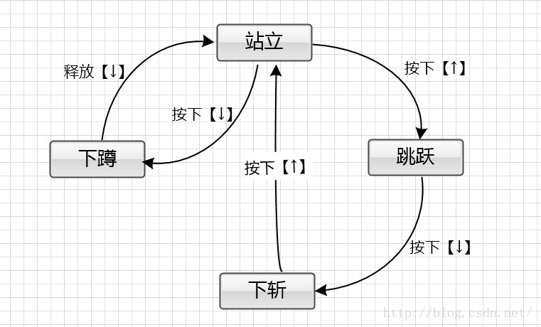

###步骤一、为状态定义一个接口
首先，我们为状态定义一个接口。每一个与状态相关的行为都定义成虚函数。对于上文的例子而言，就是handleInput和update函数

```
class HeroineState {  
public:  
    virtual ~HeroineState( ) {}  
    virtual void handleInput(Heroine& heroine, Input input) {}  
    virtual void update(Heroine& heroine) {}  
}; 

class HeroineState {  
public:  
    virtual ~HeroineState( ) {}  
    virtual void handleInput(Heroine& heroine, Input input) {}  
    virtual void update(Heroine& heroine) {}  
};  
```

###步骤二、为每个状态定义一个类
对于每一个状态，我们定义了一个类并继承至此状态接口。它覆盖的方法定义主角对应此状态的行为。换句话说，把之前的switch语句里面的每个case语句中的内容放置到它们对应的状态类里面去。比如：

```
class DuckingState : public HeroineState  
{  
	public:  
    DuckingState( )  
        :chargeTime_(0)  
    { }  
  
    virtual void handleInput(Heroine& heroine, Input input) {  
        if (input == RELEASE_DOWN)  
        {  
            // Change to standing state...  
            heroine.setGraphics(IMAGE_STAND);  
        }  
    }  
  
    virtual void update(Heroine& heroine) {  
        chargeTime_++;  
        if (chargeTime_ > MAX_CHARGE)  
        {  
            heroine.superBomb( );  
        }  
    }  
  
	private:  
   int chargeTime_;  
}; 

class DuckingState : public HeroineState {  
	public:  
    DuckingState( )  
        :chargeTime_(0)  
    { }  
  
    virtual void handleInput(Heroine& heroine, Input input) {  
        if (input == RELEASE_DOWN)  
        {  
            // Change to standing state...  
            heroine.setGraphics(IMAGE_STAND);  
        }  
    }  
  
    virtual void update(Heroine& heroine) {  
        chargeTime_++;  
        if (chargeTime_ > MAX_CHARGE)  
        {  
            heroine.superBomb( );  
        }  
    }  
  
	private:  
   int chargeTime_;  
}; 
```
###步骤三、恰当地进行状态委托
接下来，我们在主角类Heroine中定义一个指针变量，让它指向当前的状态。放弃之前巨大的switch，然后让它去调用状态接口的虚函数，最终这些虚方法就会动态地调用具体子状态的相应函数了：

```
class Heroine {  
	 public:  
    virtual void handleInput(Input input)  
    {  
        state_->handleInput(*this, input);  
    }  
  
    virtual void update( )  
    {  
        state_->update(*this);  
    }  
  
    // Other methods...  
	 private:  
    HeroineState* state_;  
};  
class Heroine {  
	 public:  
    virtual void handleInput(Input input)  
    {  
        state_->handleInput(*this, input);  
    }  
  
    virtual void update( )  
    {  
        state_->update(*this);  
    }  
  
    // Other methods...  
	private:  
   HeroineState* state_;  
};  
```

而为了“改变状态”，我们只需要将state_声明指向不同的HeroineState对象。至此，经过为状态定义一个接口，为每个状态定义一个类以及进行状态委托，经历这三步，就是的状态模式的实现思路了。

##适配器模式
将一个类的接口转换成客户希望的另外一个接口。Adapter模式使得原本由于接口不兼容而不能一起工作的那些类可以一起工作。
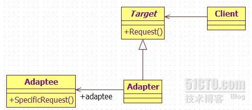
###游戏中的应用🌰

我们现在要做一个类似vs的平台，里面有众多游戏。但是这些游戏的接口和平台游戏的接口并不相同，该怎样办呢？

```
//平台的游戏接口  
class IFlatform {  
	public:  
	//游戏平台把命令和逻辑数据捆绑在一起丢给游戏逻辑  
	virtual bool ExeGame(void*) = 0;  
}  
  
class IGameHandle;  
//适配器把接口继承下来，但内部还是使用IGameHandle的东西  
class CGameAdapter:public IFlatform {  
	public:  
	CGameAdapter(IGameHandle* pGame){m_pGame = pGame;}  
      
	public:  
	virtual bool ExeGame(void*){  
	    ...  
	    return m_pGame->ExeLogic(void*);  
	}  
      
	private:  
	IGameHandle* m_pGame;  
}  
  
class IGameHandle {  
	public:  
	virtual bool ExeLogic(void*) = 0;  
}  
  
class CGame:public IGameHandle {  
	public:  
	virtual bool ExeLogic(void*){...}  
}  
```
##观察者模式
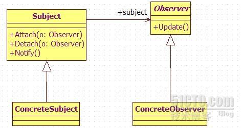
###游戏中的应用🌰
游戏中的玩家完成的任务，解锁成就
##责任链模式
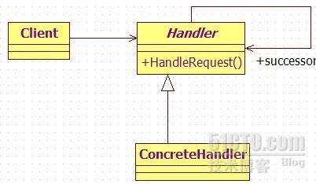
需要多次认证的时候
##迭代器模式
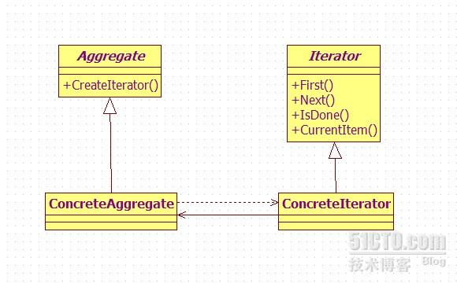

* 数组属性应该提供访问渠道？
* 初始化、添加新元素、删除元素...

##最后的最后，离线功能...
1、offlineServer 类的实现 ： 实现server所有的public接口
2、在声明方法是public还是protected／private的时候，在外部调用到的时候才把方法设置为pubilc！！！
3、属性一半不设置成public的